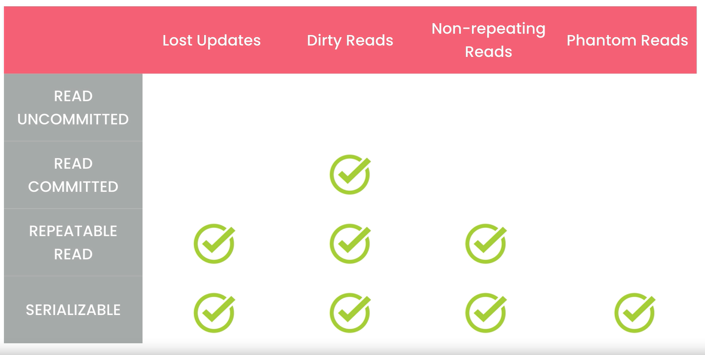
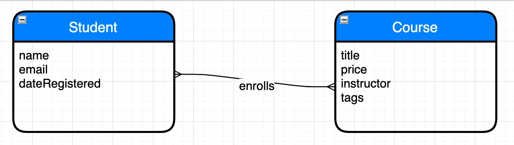
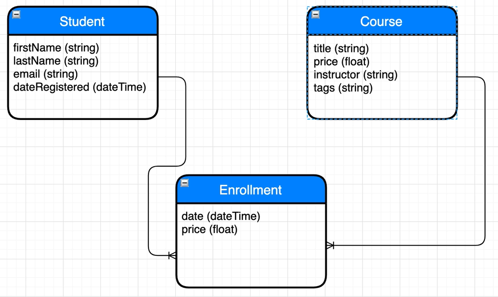
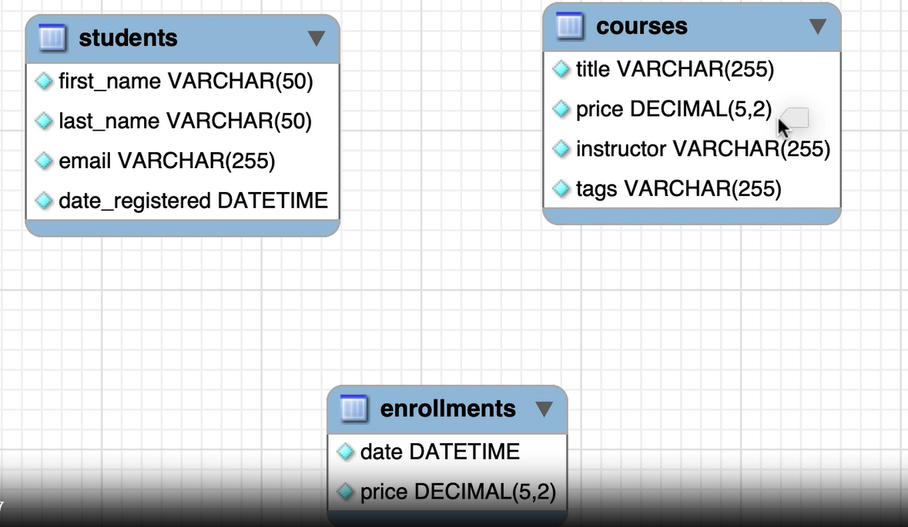

# A DATABASE

is a collection of data stored in a format that can easily be accessed.

we send our request into DBMS (Database Management System) it send into database and send us a response.

we have 2 type of data base

- Relational
- NoSQL

## Most popular RDBMS (Relational Database Management System)

- MySQL
- SQL Server
- Oracle

> NoSQL systems don't understand SQL

## The SELECT Statement

the first line use is reading database and in the example below we read all data
of customer data

```sql
USE sql_store;

SELECT *
FROM customers
```

we also have where that filter and only show matches in this example is only show the customers
with id of 1

```sql
USE sql_store;

SELECT *
FROM customers
WHERE customer_id = 1;
```

also we can filter the order and by putting this `--` before thing it will comment that

```sql
USE sql_store;

SELECT *
FROM customers
-- WHERE customer_id = 1;
ORDER BY first_name
```

the order of these is matter and we mostly sort first select then from , where and lastly order if we change it

for example add order at top because there is no data it give us syntax error

## The SELECT Clause

this is return all the columns

```sql
SELECT * FROM customers
```

we can custom and only load some specific columns and also build some custom

```sql
SELECT
    first_name ,
    last_name ,
    points ,
    (points + 10) * 100 AS 'discount factor'
FROM customers

```

with DISTINCT keyboard we can remove the duplicate

```sql
SELECT DISTINCT state FROM customers
```

## The WHERE Clause

it check condition if any of the element pass the condition is will return them

```sql
SELECT * FROM customers
WHERE points > 3000
```

these are all operation conditions we have

- >
- > =
- <
- <=
- =
- != or <> both mean no equal

here the lower and uppercase doesn't matter

```sql
SELECT * FROM customers
WHERE state <> 'va'
```

for year we have year-month-day format

```sql
SELECT * FROM customers
WHERE birth_date > '1990-01-01'
```

## The AND , OR and NOT operator

AND : Both side must pass the condition
OR : At least one side of the condition is be true
NOT : vice versa the condition

```sql
SELECT * FROM customers
WHERE birth_date > '1990-01-01' AND points > 1000 AND state = 'VA'
```

```sql
SELECT * FROM customers
WHERE NOT (birth_date > '1990-01-01' OR points > 1000)
```

the order of loading these operator is like this

1. AND
2. OR

## The IN Operator

this is the dirty way of check to get list of people from
'Va' , 'GA' , 'FL' at least one of theme

```sql
SELECT * FROM customers
WHERE state = 'VA' OR state = 'GA' OR state = 'FL'
```

and this is cleaner way

```sql
SELECT * FROM customers
WHERE state IN ('VA' , 'GA' , 'FL')
```

if we want people outside of these states we can use not like below

```sql
SELECT * FROM customers
WHERE state NOT IN  ('VA' , 'GA' , 'FL')
```

## The BETWEEN Operator

for example we want to get list of customer that have score between 1000 and 3000 one
way is below

```sql
SELECT * FROM customers
WHERE points >= 1000 AND points <= 3000
```

we can rewrite like this

```sql
SELECT * FROM customers
WHERE points BETWEEN 1000 AND 3000
```

## The LIKE Operator

in this operator is show all last that name that start with B and now matter
how long is that upper/lower cases dose not matter

```sql
SELECT * FROM customers
WHERE last_name LIKE 'b%'
```

we also have something like this that say if the last name contain b no matter where

another pattern is under score where for example here if anything has length of 5 that end with y

```sql
SELECT * FROM customers
WHERE last_name LIKE '____y'
```

this is one is little bit old

## The REGEXP Operator

this one is use regex it really powerful

- ^ in example the last name must start with field

```sql
SELECT * FROM customers
WHERE last_name REGEXP '^field'
```

- $ to indicate the end of last name end with field

```sql
SELECT * FROM customers
WHERE last_name REGEXP 'field$'
```

- | to indicate two things like field or mac or rose in user last name

```sql
SELECT * FROM customers
WHERE last_name REGEXP 'field|mac|rose'
```

also we can combine multiple character that check last name end with field

```sql
SELECT * FROM customers
WHERE last_name REGEXP 'field$|mac|rose'
```

- [] every character before specific thing for example here every last name

```sql
SELECT * FROM customers
WHERE last_name REGEXP '[gim]e'
```

also we can something like this a-h which all character from a to ----------

```sql
SELECT * FROM customers
WHERE last_name REGEXP '[a-h]e'
```

## The IS NULL Operator

this operator used to find the null

```sql
SELECT * FROM customers
WHERE phone IS NULL
```

## The Order Clause

as default the order by id and DESC is reverse the order

```sql
SELECT * FROM customers
ORDER BY first_name DESC
```

also we can have multiple things for example first is sort by state
and if state is same use first_name to order

```sql
SELECT * FROM customers
ORDER BY state , first_name
```

## The LIMIT Clause

for example we have 10 customers in table and we limit more than 10 it will
show all of them

```sql
SELECT * FROM customers
LIMIT  3000
```

and for example we have pager that show three in each page and we want the third page
6 is skipping first 6 digits and 3 is mean pick those

```sql
SELECT * FROM customers
LIMIT 6,3
```

and this will came at the end

## Inner Joins

```sql
SELECT order_id ,o.customer_id, first_name , last_name
FROM orders o
JOIN customers c
    ON o.customer_id = c.customer_id
```

## Joining Across Databases

and we only have to prefix the databases outside of current one

```sql
USE sql_inventory;

SELECT * FROM sql_store.order_items oi
JOIN products p
    ON oi.product_id = p.product_id
```

## Self Joins

```sql
SELECT
    e.employee_id,
    e.first_name,
    m.first_name AS manager
FROM sql_hr.employees e
JOIN sql_hr.employees m
    ON e.reports_to = m.employee_id
```

## Joining Multiple Tables

```sql
USE sql_store;

SELECT
    o.order_id,
    o.order_date,
    c.first_name,
    c.last_name,
    os.name AS status
FROM orders o
JOIN customers c
    ON o.customer_id = c.customer_id
JOIN order_statuses os
    ON o.status = os.order_status_id
```

and it is really common to join 12 table in SQL

## Compound Join Conditions

```sql
SELECT *
From order_items oi
JOIN order_item_notes oin
    ON oi.order_id = oin.order_Id
    AND oi.product_id = oin.product_id
```

## Implicit Join Syntax

do not use this syntax much it case cross join
better to use explicit JOIN syntax

```sql
SELECT *
From orders o , customers c
WHERE o.customer_id = c.customer_id
```

## Outer Join

when ever you write JOIN it mean INNER JOIN but it convert into JOIN
for Outer Join we have 2 types left and right

when we use left all of the in this example customers return whether this condition
is true or not

when we use right all of the right side of order which is over default and if you want to see
all customer with right you need to swap the order

```sql
SELECT
    c.customer_id,
    c.first_name,
    o.order_id
From customers c
LEFT JOIN orders o
    ON c.customer_id = o.customer_id
ORDER BY c.customer_id
```

## Outer Join Between Multiply Tables

> as best practice avoid RIGHT JOIN and focus on left JOIN for better visual

```sql
SELECT
    c.customer_id,
    c.first_name,
    o.order_id,
    sh.name AS shipper
From customers c
LEFT JOIN orders o
    ON c.customer_id = o.customer_id
LEFT JOIN shippers sh
    ON o.shipper_id = sh.shipper_id
ORDER BY c.customer_id
```

## Self Outer Joins

```sql
USE sql_hr;

SELECT
    e.employee_id,
    e.first_name,
    m.first_name AS manager
FROM sql_hr.employees e
LEFT JOIN sql_hr.employees m
    ON e.reports_to = m.employee_id
```

## The USING Clause

if the two side of ON is same we use USING like below and if one side
is different we can't use this syntax anymore

```sql
USE sql_store;

SELECT
    o.order_id,
    c.first_name,
    sh.name AS shipper
FROM orders o
JOIN customers c
    -- ON o.customer_id = c.customer_id
    USING (customer_id)
LEFT JOIN shippers sh
    USING (shipper_id)
```

## Natural Joins

this is not used widely just be familiar with it basically combine
common things but something produce unexpected results

```sql
USE sql_store;

SELECT
    o.order_id,
    c.first_name
FROM orders o
NATURAL JOIN customers c
```

## Cross Joins

```sql
SELECT
    c.first_name AS customer,
    p.name AS product
FROM customers c
CROSS JOIN products p
ORDER BY c.first_name
```

you can simplify this like this

```sql
SELECT
    c.first_name AS customer,
    p.name AS product
FROM customers c, products p
ORDER BY c.first_name
```

## Unions

used to connect two rows together or combine two tables together

```sql
SELECT
    order_id,
    order_date,
    'Active' As status
FROM orders
WHERE orders.order_date >= '2019-01-01'
UNION
SELECT
    order_id,
    order_date,
    'Archived' As status
FROM orders
WHERE orders.order_date < '2019-01-01'
```

## Column Attribution

- INT : integer number without anu float numbers
- VARCHAR(50) : variable character that hold 50 character as maximin and if user was 5 character it store 5
- CHAR(50) : character that hold 50 character the main difference if the customer type 5 it will fill 45 of it with empty space
- PK : Primary Key
- NM : Not NULL check this column should accept null value or not
- AI : Auto increment often used for id let MYSQL engine insert value

## Inserting a ROW

```SQL
INSERT INTO customers ( first_name, last_name, birth_date, address, city, state)
VALUES (
        'John',
        'Smith',
        '1990-01-01',
        'address',
        'city',
        'CA')
```

## Inserting multiple rows

```sql
INSERT INTO shippers (name)
VALUES ('Shipper1'),
       ('Shipper2'),
       ('Shipper3')
```

## Creating a Copy of table

```sql
CREATE TABLE order_archived AS
SELECT * FROM orders
```

we can filter and fill the table with the result

```sql
INSERT INTO orders_archived

SELECT *
FROM orders
WHERE order_date < '2019-01-01'
```

## Updating a Single Row

```sql
UPDATE sql_invoicing.invoices
SET payment_total = 10 , payment_date = '2019-03-01'
WHERE invoice_id = 1
```

you can also done calculation

## Updating a Multiple Row

the syntax is same but you have to write more general condition

```sql
UPDATE sql_invoicing.invoices
SET
    payment_total = invoice_total * 0.5 ,
    payment_date = due_date
WHERE client_id = 3
```

## Using Subqueries in Updates

```sql
UPDATE sql_invoicing.invoices
SET
    payment_total = invoice_total * 0.5 ,
    payment_date = due_date
WHERE client_id =

(SELECT client_id FROM sql_invoicing.clients
WHERE name = 'Myworks'
)
```

also you can use IN

```sql
UPDATE sql_invoicing.invoices
SET
    payment_total = invoice_total * 0.5 ,
    payment_date = due_date
WHERE client_id IN

(SELECT client_id FROM sql_invoicing.clients
WHERE state IN ('CA', 'NY')
)
```

## Delete Rows

```sql
DELETE FROM sql_invoicing.invoices
WHERE client_id = (
    SELECT * FROM sql_invoicing.clients
    WHERE name = 'Mywork'
)
```

## Aggregate Function

> The count method show the numbers of not null elements but if you want to see all you have to use this

```sql
COUNT (*) AS total_records
```

```sql
SELECT
    MAX(invoice_total) AS hights,
    MIN(invoice_total) AS lowest,
    AVG(invoice_total) AS average,
    SUM(invoice_total) AS total,
    COUNT(invoice_total) AS number_of_invoices,
    COUNT(payment_date) AS count_of_payment,
    COUNT(*) AS total_records
FROM sql_invoicing.invoices
```

## The GROUP BY Clause

```sql
SELECT
    client_id,
    SUM(invoice_total) AS total_sales
FROM sql_invoicing.invoices
WHERE invoice_date >= '2019-07-01'
GROUP BY client_id
ORDER BY total_sales DESC
```

this is the order of items

1. SELECT
2. FROM
3. WHERE
4. GROUP
5. ORDER

## The HAVING Clause

- **WHERE** filters rows before grouping (works with GROUP BY).

- **HAVING** filters groups after grouping (used with aggregate functions like SUM, COUNT).

```sql
SELECT
    client_id,
    SUM(invoice_total) AS total_sales,
    COUNT(*) AS number_of_invoces
FROM sql_invoicing.invoices
GROUP BY client_id
HAVING total_sales > 500 AND number_of_invoces > 5
```

## The ROLLUP Operator

ROLLUP adds extra summary rows (subtotals and a grand total) to a GROUP BY result, rolling up from detailed to total.

```sql
SELECT
    state,
    city,
    SUM(invoice_total) AS total_sales
FROM sql_invoicing.invoices i
JOIN sql_invoicing.clients c USING (client_id)
GROUP BY state, city WITH ROLLUP
```

## Subqueries

```sql
SELECT *
FROM products
WHERE unit_price > (
    SELECT  unit_price
    FROM products
    WHERE product_id = 3
)
```

### The IN Operator

```sql
USE sql_store;

SELECT *
FROM products
WHERE product_id NOT IN (
    SELECT DISTINCT  product_id
    FROM order_items
)
```

## Subqueries vs Joins

Subqueries : Is more readable than Join

if performance is same go into readability

## The ALL Keywords

this show all invoices that are greater than 3

```sql
USE sql_invoicing;

SELECT * FROM invoices
WHERE invoice_total > (
    SELECT MAX(invoice_total)
    FROM invoices
    WHERE client_id = 3
)
```

we can do the same with ALL keyword

```sql
USE sql_invoicing;

SELECT * FROM invoices
WHERE invoice_total > ALL (
    SELECT invoice_total
    FROM invoices
    WHERE client_id = 3
)
```

ALL is to compare with all values

## The ANY keyword

we also have any and some that is if is any or some of them are greater than 3

like this example where clients with at least tow invoices

```sql
SELECT *
FROM clients
WHERE client_id = ANY (
    SELECT client_id
    FROM invoices
    GROUP BY client_id
    HAVING COUNT(*) >=2
)
```

also we can do that with in as well

```sql
SELECT *
FROM clients
WHERE client_id IN (
    SELECT client_id
    FROM invoices
    GROUP BY client_id
    HAVING COUNT(*) >=2
)
```

## Correlated Subqueries

Select employees whose salary is above the average in their office

this is the sudo code of it

```
- for each employee
    - calculate the avg salary for employee.office
    - return the employee if salary > avg
```

this how we do it

```sql
USE sql_hr;

SELECT * FROM employees e
WHERE salary > (
    SELECT AVG(salary)
    FROM employees
    WHERE office_id = e.office_id
)
```

> correlated subqueries : is executed for each row in main query and sometime ca be slow based amount of data you have

## The EXIT Operator

Task : Select clients that have an invoice

```sql
USE sql_invoicing;

SELECT * FROM clients
WHERE client_id IN (
    SELECT DISTINCT client_id
    FROM invoices
)
```

also we can do the same with slightly different format

```sql
USE sql_invoicing;

SELECT * FROM clients c
WHERE EXISTS(
    SELECT client_id
    FROM invoices
    WHERE client_id = c.client_id
)
```

> For subquery that has return large result better to use EXIT
> Because when we use EXIT it not return anything to outer query

## Subqueries in the SELECT Clause

```sql
USE sql_invoicing;

SELECT
    invoice_id ,
    invoice_total,
    (SELECT AVG(invoice_total)
     FROM invoices) AS invoice_average,
    invoice_total - (SELECT invoice_average) AS difference
FROM invoices
```

## Subqueries in the FROM Clause

```sql
SELECT *
FROM (
    SELECT
        client_id,
        name,
        (SELECT SUM(invoice_total)
            FROM invoices
            WHERE client_id = c.client_id
         ) AS total_sales,
        (SELECT AVG(invoice_total) FROM invoices) AS average,
        (SELECT total_sales - average ) AS difference
    FROM clients c
) AS sales_summary
WHERE total_sales IS NOT NULL
```

> USE this for simple queries

## Numeric Functions

we have `ROUND` in second argument specify the digits to round

```sql
SELECT ROUND (5.73 , 1)
```

we have `TRUNCATE` keep the amount digit set in second argument
after decimal point and remove the rest in this example after 2
digit it remove

```sql
SELECT TRUNCATE (5.7345 , 2)
```

The `CEILING` return smallest integer or equal to the number

```sql
SELECT CEILING (5.2)
```

The `FLOOR` return later or equal to that integer

```sql
SELECT FLOOR (5.2)
```

The `ABS` always return positive number

```sql
SELECT ABS (-5.2)
```

The `RAND` random number between 0 to 1

```sql
SELECT RAND()
```

## String Function

The `LENGTH` return numbers of characters

```sql
SELECT LENGTH ('sky')
```

We have `UPPER` and `LOWER` to change case of character

```sql
SELECT UPPER ('Sky')

SELECT LOWER ('Sky')
```

we have trims function to remove empty spaces that in data

`LTRIM` : Left Trim
`RTRIM` : Right Trim
`TRIM` : for left and rights both side

```sql
SELECT TRIM ('    Sky   ')
```

we have `LEFT` that have two argument first is string and second
amount of character get from that value and have `RIGHT` that do opposite
of left

```sql
SELECT LEFT ('Kindergarten' , 4);

SELECT RIGHT ('Kindergarten' , 6);
```

The `SUBSTRING` that has 3 argument

1. the string
2. where to start
3. where to end (Optional if not provide it go up to end of string)

and return that string

```sql
SELECT SUBSTRING ('Kindergarten' , 3, 5);
```

The `LOCATE` have 2 parameter

1. what character or sequence of characters do you search and it show index and it not case-sensitive
2. the string

```sql
SELECT LOCATE ('n','Kindergarten' );
```

if not exit is return 0

The `REPLACE` have 3 argument

1. the string
2. which value to replace
3. the new value for replace

```sql
SELECT REPLACE ('Kindergarten' , 'garten' , 'garden');
```

The `CONCAT` to concatenate two strings into one string

```sql
SELECT CONCAT('first', 'name')
```

## Date Function

The `NOW` to get current time and also

- CURDATE : for only current data
- CURTIME : for only current time

```sql
SELECT NOW()
```

we can extract date like this to only show year
we also have

- YEAR
- MONTH
- DAY
- HOUR
- MINUTE
- SECOND
- DAYNAME (name of day like monday)
- MONTHNAME (name of month like march)

```sql
SELECT YEAR(NOW())
```

## Formatting Dates and Times

The DATE_FORMAT the first is date and second is the format of it like this
example it is only show 2 digits of the year

```sql
SELECT DATE_FORMAT(NOW() , "%y")
```

but if we use Capital Y it show full year
we have %m to display month and capital M to show Month name
. we can also change the order as well and %d for day and %D for
third , fourth something like that

```sql
SELECT DATE_FORMAT(NOW() , "%M %d %Y")
```

we have TIME_FORMAT but with different identifier for second argument

```sql
SELECT TIME_FORMAT(NOW() , "%H:%i %p")
```

## Calculating Dates and Times

We have DATE_ADD the first argument is current and second is the amount we want to add
it can be a year or day or any other valid thing for backward use negative value

```sql
SELECT DATE_ADD(NOW() , INTERVAL 1 YEAR)

SELECT DATE_ADD(NOW() , INTERVAL 1 DAY)

SELECT DATE_ADD(NOW() , INTERVAL -1 YEAR)
```

also for backward you can use DATE_SUB as well instead of negative pass positive number

```sql
SELECT DATE_SUB(NOW() , INTERVAL 1 YEAR)
```

for calculating between two date we can use DATEDIFF and it only perform on date not hours

```sql
SELECT DATEDIFF('2025-01-01' , '2025-01-05')
```

we have TIME_TO_SEC which show the amount of second to midnight for get different we subtract one
into another

```sql
SELECT TIME_TO_SEC('09:02') - TIME_TO_SEC('09:00')
```

## The IFNULL and COALESCE Functions

The IFNULL show something else rather than NULL for user

```sql
USE sql_store;

SELECT
    order_id,
    IFNULL(shipper_id , 'Not assigned') AS shipper
FROM orders
```

we have COALESCE that first check value if not it check comment if that null
it return the third defined value

```sql
USE sql_store;

SELECT
    order_id,
    COALESCE(shipper_id, comments , 'Not assigned') AS shipper
FROM orders
```

## The IF function

The syntax function is like below if expression success show first if not
show second

```
IF(expression, first , second)
```

```sql
USE sql_store;

SELECT
    order_id,
    order_date,
    IF(
            YEAR(order_date) = YEAR(DATE_SUB(NOW(), INTERVAL 7 YEAR)),
            'Active' ,
            'Archived'
    ) AS category
FROM orders
```

## The CASE Operator

```sql
USE sql_store;

SELECT
    order_id,
    CASE
        WHEN YEAR(order_date) = YEAR(DATE_SUB(NOW(), INTERVAL 7 YEAR)) THEN 'Active'
        WHEN YEAR(order_date) = YEAR(DATE_SUB(NOW(), INTERVAL 8 YEAR)) THEN 'Last Year'
        WHEN YEAR(order_date) < YEAR(DATE_SUB(NOW(), INTERVAL 8 YEAR)) THEN 'Archived'
        ELSE 'Future'
    END AS category
FROM orders
```

## Creating Views

it reusable query that can be used in multiple places

```sql
USE sql_invoicing;

CREATE VIEW sales_by_client AS
SELECT
    c.client_id,
    c.name,
    SUM(invoice_total) AS total_sales
FROM clients c
JOIN invoices i USING (client_id)
GROUP BY client_id, name
```

## Altering or Dropping Views

```sql
DROP VIEW sales_by_client
```

you can create or replace like below

```sql
CREATE OR REPLACE VIEW sales_by_client AS
```

## Updating View

If you don't have any of these in view you can refer as an updatable view

- DISTINCT
- Aggregate Functions (MIN , MAX , SUM)
- GROUP BY / HAVING
- UNION

```sql
USE sql_invoicing;

CREATE OR REPLACE VIEW invoices_with_balance AS
SELECT
    invoice_id,
    number,
    client_id,
    invoice_total,
    payment_total,
    invoice_total - payment_total AS balance,
    invoice_date,
    due_date,
    payment_date
FROM invoices
WHERE (invoice_total - payment_total) > 0
```

this how to delete something from view

```sql
DELETE FROM invoices_with_balance
WHERE invoice_id = 1
```

this how to update the view

```sql
UPDATE invoices_with_balance
SET due_date = DATE_ADD(due_date, INTERVAL 2 DAY)
WHERE invoice_id = 2
```

## THE WITH OPTION CHECK Clause

if we have condition in our pervious view that if the condition
failed it will not show that for preventing this we could add
at the bottom of the view

```sql
WITH CHECK OPTION
```

this prevent removing

## Other Benefits of Views

- Simplify queries
- Reduce the impact of changes
- Restrict access to the data

## Stored Procedures

A place that contain SQL queries we use it for

- Store and organize SQL
- Faster execution
- Data Security

## Creating a Stored Procedure

```sql

DELIMITER  $$
CREATE PROCEDURE get_clients()
BEGIN
    SELECT * FROM clients;
END$$

DELIMITER ;
```

we can call this like below

```sql
CALL get_clients()
```

## Dropping Stored Procedures

```sql
DROP PROCEDURE IF EXISTS  get_clients
```

## Parameters

```sql
DROP PROCEDURE IF EXISTS  get_clients_by_state;

DELIMITER  $$
CREATE PROCEDURE get_clients_by_state(
    state CHAR(2)
)
BEGIN
    SELECT * FROM clients c
    WHERE c.state = state;
END$$

DELIMITER ;
```

## Parameters with Default Value

```sql
DROP PROCEDURE IF EXISTS  get_clients_by_state;

DELIMITER  $$
CREATE PROCEDURE get_clients_by_state(
    state CHAR(2)
)
BEGIN
    IF state IS NULL THEN
        SELECT * FROM clients;
    ELSE
        SELECT * FROM clients c
        WHERE c.state = state;
    END IF;
END$$

DELIMITER ;
```

we can refactor it like this

```sql
DROP PROCEDURE IF EXISTS  get_clients_by_state;

DELIMITER  $$
CREATE PROCEDURE get_clients_by_state(
    state CHAR(2)
)
BEGIN
    SELECT * FROM clients c
    WHERE c.state = IFNULL(state , c.state);
END$$

DELIMITER ;
```

## Parameter Validation

write validation as minimum as possible

```sql

DELIMITER  $$
CREATE PROCEDURE make_payment (
    invoice_id INT,
    payment_amount DECIMAL(9,2),
    payment_date DATE
)
BEGIN
    IF payment_amount <= 0 THEN
        SIGNAL SQLSTATE '22003'
            SET MESSAGE_TEXT = 'Invalid payment';

    END IF;
    UPDATE invoices i
    SET
        i.payment_total = payment_amount,
        i.payment_date = payment_date
    WHERE i.invoice_id = invoice_id;
END$$

DELIMITER ;
```

## Output Parameters

do not use this often if you have valid reason for it not much useful

```sql

DELIMITER  $$
CREATE PROCEDURE get_unpaid_invoices_for_client (
    client_id INT,
    OUT invoices_count INT,
    OUT invoices_total DECIMAL(9,2)
)
BEGIN
    SELECT COUNT(*) , SUM(invoice_total)
    INTO invoices_count, invoices_total
    FROM invoices i
    WHERE i.client_id = client_id
        AND payment_total = 0;
END$$

DELIMITER ;
```

## Variable

we one type if called User or session variable that will be as long
as user terminate the SQL

```sql
SET @invoices_count = 0
```

we also have another type called Local variables and it be free after
function execution

```sql

DELIMITER  $$
CREATE PROCEDURE get_risk_factor()
BEGIN
    DECLARE risk_factor DECIMAL(9,2) DEFAULT 0;
    DECLARE invoices_total DECIMAL(9,2);
    DECLARE invoices_count INT;

    SELECT COUNT(*), SUM(invoices_total)
    INTO invoices_count, invoices_total
    FROM invoices;

    SET risk_factor = invoices_total / invoices_count * 5;

    SELECT risk_factor;

END$$

DELIMITER ;
```

## Functions

```sql
CREATE FUNCTION get_risk_factor_for_client
(
    client_id INT
)
RETURNS INTEGER
READS SQL DATA
BEGIN
    DECLARE risk_factor DECIMAL(9,2) DEFAULT 0;
    DECLARE invoices_total DECIMAL(9,2);
    DECLARE invoices_count INT;

    SELECT COUNT(*), SUM(invoices_total)
    INTO invoices_count, invoices_total
    FROM invoices i
    WHERE i.client_id = client_id;

    SET risk_factor = invoices_total / invoices_count * 5;

    RETURN IFNULL(risk_factor,0);
END
```

this how to use this function

```sql
SELECT
    client_id,
    name,
    get_risk_factor_for_client(client_id)
FROM clients
```

and this how to remove function

```sql
DROP FUNCTION IF EXISTS get_risk_factor_for_client;
```

## Trigger

A block of SQL code that automatically gets executed before or after an insert , update or delete statement.

```sql
DELIMITER $$

CREATE TRIGGER payments_after_insert
    AFTER INSERT ON payments
    FOR EACH ROW
BEGIN
    UPDATE invoices
    SET payment_total = payment_total + NEW.amount
    WHERE invoice_id = NEW.invoice_id;
END $$

DELIMITER ;
```

## Viewing Triggers

we use this way to see the trigger

```sql
SHOW TRIGGER
```

we also can filter like this as well

```sql
SHOW TRIGGER LIKE 'payments%'
```

## Dropping Triggers

```sql
DROP TRIGGER IF EXISTS payments_after_insert;
```

## Using Triggers for Auditing

we can use triggers for storing logs

```sql
INSERT INTO payments_audit
VALUES (NEW.client_id, NEW.date , NEW.amount , 'Insert', NOW())

INSERT INTO payments_audit
VALUES (OLD.client_id, OLD.date , OLD.amount , 'Delete', NOW())
```

## Events

A task (or block of SQL code) that gets executed according to a schedule

you have to run it on you check like this and if is was OFF turn on like below

```sql
SHOW VARIABLES LIKE 'event%';
SET GLOBAL event_scheduler  = ON;
```

```sql
DELIMITER $$

CREATE EVENT yearly_delete_stale_audit_rows
ON SCHEDULE
    EVERY 1 YEAR STARTS '2019-01-01' ENDS '2029-01-01'
DO BEGIN
    DELETE FROM payments_audit
    WHERE action_date < NOW() - INTERVAL 1 YEAR;
END $$
DELIMITER ;
```

## Viewing and Dropping Events

we use this to see events

```sql
SHOW EVENTS
```

for drop we do like this

```sql
DROP EVENT IF EXISTS yearly_delete_stale_audit_rows
```

we also have ALTER to edit the event

or disable like below

```sql
ALTER EVENT yearly_delete_stale_audit_rows ENABLE
```

## Transactions

A group of SQL statements that represent a single unit of work.

for example bank that both operation must be successful

### ACID Properties

- Atomicity
- Consistency
- Isolation
- Durability

## Creating Transactions

```sql
USE sql_store;

START TRANSACTION;

INSERT INTO orders (customer_id , order_date, status)
VALUES ( 1, '2026-06-06', 1);

INSERT INTO order_items
VALUES (LAST_INSERT_ID(), 1, 1, 1);

COMMIT;
```

we can also add bottom at ROLLBACK to change back all change if transaction is failed

## Concurrency and Locking

is two user get one data at once and want to edit

## Concurrency Problems

- Lost Updates
- Dirty Reads
- Non-repeating Reads
- Phantom Reads

## Transaction Isolation Levels

;

this how to see and change Isolation levels

```sql
SHOW VARIABLES LIKE 'transaction_isolation';
SET GLOBAL TRANSACTION ISOLATION LEVEL SERIALIZABLE ;
```

## READ UNCOMMITTED Isolation Level

this is lowest level and you may experience so many problems

```sql
Use sql_store;
SET GLOBAL TRANSACTION ISOLATION LEVEL READ UNCOMMITTED ;
SELECT points
FROM customers
WHERE customer_id = 1
```

and this second user

```sql
Use sql_store;
START TRANSACTION ;
UPDATE customers
SET points = 20
WHERE customer_id = 1;
COMMIT ;
```

## Deadlocks

It happens when two or more transactions each hold a lock on a resource that
the other needs to proceed , creating a circular wait. For example, Transaction A
locks Row 1 and wants Row 2, while Transaction B locks Row 2 and wants Row 1.
Neither can finish because each is waiting for the other to release its lock.

The database automatically detects this deadlock and terminates one transaction (the "victim"),
rolling back its work, so the other can complete

## Data Types

- String Types
- Numeric Types
- Date and Time Types
- Blob Types
- Spatial Types

### String Types

- CHAR - fixed-length
  - 50 for short string
- VARCHAR - max : 65,535 character (~64KB)
  255 for medium length strings
- MEDIUMTEXT - max 16MB
- LONGTEXT - max 4GB
- TINYTEXT - max 255 bytes
- TEXT - max : 64KB

#### Bytes

English uses 1
European Middle-eastern uses 2
Asian uses 3

### Integer Types

- TINYINT: 1b [-128 , 127]
- UNSIGNED TINYINT: [0 , 255]
- SMALLINT : 2b [-32k , 32k]
- MEDIUMINTINT : 3b [-8M , 8M]
- INT : 4b [-2B , 2B]
- BIGINT 8b [9Z , 9Z]

#### Zerofill

- INT(4) => 0001

> Use the smallest data type that suits your needs.

### Fixed-point and Floating-point Types

- DECIMAL (p,s) example DECIMAL(0,2) => 1234567.89
    - All belows are the same
    - DEC
    - NUMERIC
    - FIXED


and we have 

- FLOAT 4B
- DOUBLE 8B

### Boolean Types 

- BOOL
- BOOLEAN

### Enum and Set Types 

for situation that we want limit range of values like S , M , L only from this 
we use Enum and we have SET that work the same as Enum

### Date and Time Types 

- DATE
- TIME
- DATETIME 8b
- TIMESTAMP 4b (up to 2038)
- YEAR

### Blob Types 

- TINYBLOB      225b
- BLOB          65KB
- MEDIUMBLOB    16MB
- LONGBLOB      4GB

Problems with storing files in a database

- Increased database size
- slower backups
- Performance problems
- More code to read/write images

### JSON Type 

Lightweight format for storing and transferring data over the Internet.

```sql
UPDATE products
SET properties = JSON_OBJECT(
        'weight', 10,
        'dimensions', JSON_ARRAY(1, 2, 3),
        'manufacturer', JSON_OBJECT('name', 'sony')
)
WHERE product_id = 1
```

```sql
SELECT product_id , properties ->> '$.manufacturer.name'
FROM products
WHERE product_id = 1;
```

and this how to update and add more

```sql
UPDATE products
SET properties = JSON_SET(
        properties,
        '$.weight', 20,
        '$.age', 10
                 )
WHERE product_id = 1
```

and we have JSON_REMOVE to remove data

## Data Modelling

- Understand the requirements
- Build a Conceptual Model
- Build a Logical Model
- Build a Physical Model

## Conceptual Models

> Represents the entities and their relationships.

### Modelling Tools

- Microsoft Visio 
- draw.io
- LucidCharts


;

## Logical Models

more detailed like type and type of relationships and etc

we have 3 relationships

- One-to-one
- One-to-many
- Many-to-many

;

## Physical Model 

is way to implement the database with which technology you wants

;
